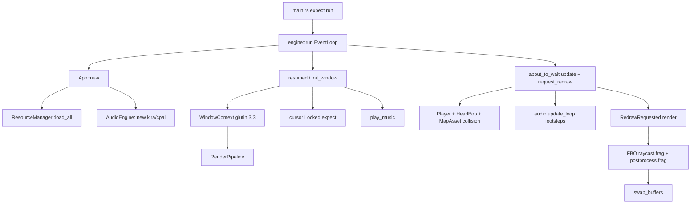

# Architecture of `pseudo3d`

Review of the code on branch `main`, commit `33767305be1149970f2c64849e5d06ecbfdda770` (`feat: sounds`). This describes what is in the tree, not a proposed rewrite. No invented modules, types, or files: there is no `src/input/`, no ECS, and no separate world crate.

Runtime panics (audio with no device, `CursorGrabMode::Locked`) are recorded in [issue #1](https://github.com/wismh/underlife/issues/1).

Unmarked claims are facts from the code. **Hypothesis** means an inference not proven by a test in this repository.

---

## 1. What this program is

This is a **Wolfenstein-style grid DDA raycaster**, not a CPU software renderer and not a 3D mesh pipeline.

- **Windowing:** `winit` 0.30 `ApplicationHandler` (`src/engine/app.rs`).
- **GL:** `glutin` 0.32 + `glutin-winit` 0.5, **OpenGL 3.3 core** (`ContextApi::OpenGl(Some(Version::new(3, 3)))` in `src/engine/window.rs`).
- **Loader:** `glow` 0.16.
- **Draw style:** **retained GPU objects** (programs, empty VAO, textures, FBO) + **one fullscreen triangle per pass** via `gl_VertexID` (`draw_arrays(TRIANGLES, 0, 3)`). There is no VBO, no mesh, no CPU column loop.
- **Projection:** 2.5D. Camera is `pos` + `dir` in the XY plane. FOV is a camera **plane** vector. The fragment shader rebuilds it as `vec2(-dir.y, dir.x) * 0.66` (`assets/shaders/raycast.frag`). `Player.plane` / `plane_scale` from `player.toml` are **not** uploaded to the GPU.
- **Post:** color FBO → vignette fullscreen pass (`OpenGlPostFx`).
- **Audio:** `kira` 0.12 / `cpal`.

Genre: first-person maze walkthrough (one hardcoded demo map), WASD + mouse look, looping footsteps, one music track.

---

## 2. Crate / module map

The binary is a one-liner:

```rust
// src/main.rs
fn main() {
    pseudo3d::run().expect("engine run failed");
}
```

`src/lib.rs` exports five modules and `engine::run`.

```
pseudo3d
├── engine     window + App (composition root, loop, input, demo wiring)
├── game       Player, HeadBob, PlayerConfig  (no world, no entities)
├── render     pipeline, GPU raycast, post FX
├── audio      kira AudioEngine + unused mixer stubs
└── resources  manifest IDs, loaders, TypedStore
```

| Module | Role | Depends on |
| --- | --- | --- |
| `engine::app` | Event loop, `App` god-object, hardcoded demo bindings (`texture::BRICK`, `map::DEMO`, …) | audio, game, render, resources, winit |
| `engine::window` | Create window, GL 3.3 context, surface, vsync, own `RenderPipeline` | render, glutin, winit |
| `game::player` | Pose + collision vs `MapAsset` | resources (map) |
| `game::head_bob` | Walk/idle offsets | `PlayerConfig` numbers |
| `game::config` | Parse `player.toml` via `ConfigAsset` | resources |
| `render::pipeline` | Scene FBO + raycast + post | opengl backend, `MapAsset`/`TextureAsset`/`ShaderAsset` |
| `render::raycast` | Generic `RaycastRenderer<B: RenderBackend>` holding uploaded textures | resources types, `RenderBackend` |
| `render::backend::opengl` | Real GL: compile, uniforms, texture upload, draw | glow, glutin config pick |
| `render::postprocess` | `PostFxSettings` + `PostProcessBackend` trait **parameterized on `glow::Context`** | glow |
| `audio::engine` | kira manager, clip cache, loops, music A/B, one-shot pool | resources, kira |
| `audio::{api,presets,spatial,volume,mixer}` | Types, preset resolve, 2D pan, dB helpers, **stub mixer** | resources UIDs |
| `resources::*` | `build.rs`-generated IDs, `ResourceManager::load_all`, typed UID stores | filesystem, toml, image |

**There is no circular `mod` cycle** (it compiles). There **is** inverted layering:

- `resources::types::config::ConfigAsset::post_fx` returns `crate::render::{PostFxSettings, VignetteSettings}` (`src/resources/types/config.rs`). The asset layer knows render types.
- `engine` knows every generated UID and every gameplay system.

**God-object:** `App` owns window, resources, audio, player, head-bob, key set, post-FX settings, footstep loop handle, and player config.

**Engine vs game:** `engine` is not a reusable host. Demo rules live there: which map, which textures, WASD, Escape-to-quit, music start, footstep loop. `game` is only pose + bob + TOML structs.

**Fake vs real abstraction:**

- `RenderBackend` looks multi-backend. `RenderPipeline` is `RaycastRenderer<OpenGlBackend>` plus `OpenGlPostFx`. Post is **not** behind `RenderBackend`; it takes `&glow::Context`.
- `MixerState` is documented as “placeholder hooks” with empty `set_ducking` / `set_reverb_send` / `set_eq_low` (`src/audio/mixer.rs`). `AudioEngine` still stores it.

**No ECS.** State is a handful of structs on `App`.

---

## 3. Frame loop (window, events, timing)

### Boot (before any frame)

```
main
  → pseudo3d::run()                          // engine/app.rs:17
      EventLoop::new()?                      // needs DISPLAY/Wayland
      listen_device_events(WhenFocused)
      App::new()                             // load assets + audio, no window yet
      event_loop.run_app(&mut app)
```

`App::new` (`src/engine/app.rs`, ~lines 39–62):

1. `ResourceManager::load_all()` — panics on missing assets dir / decode.
2. Parse postprocess + player configs (`.expect`).
3. `AudioEngine::new(&resources).expect("init audio engine")` — **opens cpal/ALSA here**, before `resumed`.
4. `create_loop_handle()` for footsteps.
5. Spawn `Player` from TOML; `window: None`.

**Confirmed (run of this tree):** no sound device → panic at `app.rs:47` before a window exists. See [issue #1](https://github.com/wismh/underlife/issues/1).

### Window / GL ownership

`WindowContext` (`src/engine/window.rs`) owns:

- `Arc<winit::window::Window>`
- `glutin` `Surface<WindowSurface>` + `PossiblyCurrentContext`
- `RenderPipeline` (GL objects)

Created only in `ApplicationHandler::resumed` → `init_window`.

`init_window` (`app.rs`, ~65–87):

1. `WindowContext::create(..., raycast_shader, post_shader)` — window, GL 3.3, swap interval **Wait(1)** (vsync), `glow` loader, `RenderPipeline::new`.
2. `upload_gpu_resources` — bind brick/floor/sky + `map::DEMO` into the renderer.
3. `capture_mouse` — `CursorGrabMode::Locked.expect("capture mouse")`.
4. `audio.play_music(Preset(MUSIC), loop, 2s fade)`.
5. Store window.

**Confirmed:** on TigerVNC and Xvfb, this panics at `app.rs:93` after GL create/upload, so **no `RedrawRequested` frame runs**. See [issue #1](https://github.com/wismh/underlife/issues/1).

### Per-tick split

| Callback | What it does |
| --- | --- |
| `resumed` | `init_window` once |
| `window_event` | close/Escape → `event_loop.exit()`; focus → grab/ungrab + `mouse_look`; resize → `window.resize`; keys into `HashSet<KeyCode>`; `RedrawRequested` → `render()` |
| `device_event` | if `mouse_look`, `MouseMotion.delta.0` → `player.rotate(delta * mouse_sensitivity)` (yaw only) |
| `about_to_wait` | if window exists: `dt = min(elapsed, 0.05)`, `update(dt)`, `request_redraw()` |

**Timing:** wall-clock `Instant`, **hard cap 50 ms**. Not fixed-step, not accumulator. `about_to_wait` + `request_redraw` is a **poll-style loop**; vsync is the swap-interval wait inside `present()`.

**Hypothesis:** under a compositor that never vsync-blocks, this can spin `about_to_wait` as fast as the event loop allows; that was not measured in this repo.

`render()` builds a `RaycastScene` from player + head-bob, `renderer.draw`, `swap_buffers`.

There is **no separate input module**. Keyboard state is `App.keys`. Mouse grab is `App` methods.

---

## 4. Rendering pipeline

```
RaycastScene (CPU uniforms)
        │
        ▼
RenderPipeline::draw
  OpenGlPostFx::begin_scene_pass   bind scene FBO, viewport, clear
  RaycastRenderer::draw
    OpenGlBackend::begin_frame     clear, bind raycast program + empty VAO
    OpenGlBackend::draw_raycast    uniforms + 4 textures + draw 3 verts
    end_frame                      no-op
  OpenGlPostFx::apply_postprocess  default FB, vignette program, draw 3 verts
WindowContext::present             swap_buffers
```

### CPU vs GPU

**CPU:** decode PNG to RGBA (`TextureAsset`), parse map to `cells` + `collision` R8, compile shader **source strings**, upload once. Each frame: pack `RaycastScene` (size, pos, dir, bob). Collision `Player::move_relative` samples `MapAsset` on CPU.

**GPU:** DDA in `raycast.frag` (max 64 steps). Map is `sampler2D` R8; walls if `texture(u_map).r > 0.5`. Floor/ceiling are affine “row distance” samples, not a second raycast of height.

Fullscreen triangle is generated in **both** verts (`raycast.vert`, `postprocess.vert`) from `gl_VertexID`. No CPU vertex data.

### Camera / projection

Classic raycaster:

```
camera_x = 2 * frag.x / width - 1
plane = perpendicular(dir) * 0.66     // HARDCODED in shader
ray_dir = dir + plane * camera_x
```

`Player` maintains `plane` from `plane_scale` (`player.toml` = 0.66) but `RaycastScene` only has `player_pos` / `player_dir` / `view_bob`. Changing `plane_scale` **does not change FOV on screen**. That is a confirmed data-path split, not a hypothesis.

Head-bob: `u_view_bob.x` shifts world pos along camera right; `u_view_bob.y` shifts horizon in **pixels** (comment on `RaycastScene`).

Fog, max steps, wall side-shading (`0.75` on Y hits), ceiling `* 0.85` are **shader constants**.

### Hardcoded vs data-driven

| Data-driven | Hardcoded in engine/shader |
| --- | --- |
| Shader **source files** via manifest | GL 3.3, NEAREST wall/floor, REPEAT wrap |
| PNG textures (which file) | Which UID is wall/floor/ceiling (`BRICK`/`FLOOR`/`SKY`) |
| `demo.map` layout | Single map `map::DEMO`; cell values collapsed to 0/1 wall |
| `postprocess.toml` vignette | Unity-style remap in `VignetteSettings::unity_shader_settings` |
| `player.toml` speeds, bob, spawn | FOV `0.66` in frag; window 1280×720 / title `"pseudo3d"` |
| | `MAX_STEPS = 64`, `FOG_DISTANCE = 8.0` |

`pick_gl_config` prefers configs with transparency, then **fewer** samples (`src/render/backend/opengl/mod.rs`). Unusual for a game (MSAA is unused by the raycast anyway).

`GlTexture` has **no `Drop`**. `OpenGlBackend::drop` deletes program + VAO only. Re-upload via `set_*_texture` leaks the previous GL texture. **Confirmed** from Drop impls, not observed in a leak tool.

---

## 5. World / map / game state

**Not a world simulation.** One static `MapAsset` plus one `Player`.

`demo.map` is ASCII: `#`/`1` wall, `.`/`0`/` ` empty, anything else treated as wall (`parse_row`). `;` comments, empty lines skipped. Duplicate `cells` (0/1) and `collision` (0/255) for GPU.

**Load path:**

1. **Build:** `build.rs` parses `assets/manifest.toml`, emits `OUT_DIR/asset_ids.rs` (UID constants + `TEXTURES`/`MAPS`/… slices), copies `assets/` → `target/{debug,release}/assets`.
2. **Runtime:** `ResourceManager::load_all` resolves root (`PSEUDO3D_ASSETS`, else next-to-exe `assets/`, else debug-only `CARGO_MANIFEST_DIR/assets`), then loads **every** manifest entry into `TypedStore` (vec indexed by UID).

Ownership: `App.resources` is immutable after load (`&self` getters). GPU copies live on `RaycastRenderer`. Mutating the map at runtime would not update the R8 texture unless `set_map` is called again (nothing does).

`Player` mutates `pos`/`dir`/`plane`. Collision: axis-separated, `is_wall` on cell centers via `floor`, then clamp to `[0.25, dim-1.25]`. No entities, doors, sprites, or height.

---

## 6. Audio

`AudioEngine::new`:

- `AudioManager::<DefaultBackend>::new` (cpal).
- SFX + music subtracks; kira `add_listener` (3D listener handle stored, `#[allow(dead_code)]` on the field but `set_listener` uses it).
- `StaticSoundData::from_file` for every `SOUNDS` entry (decode at init, not stream).
- `SoundPresetRegistry` maps preset TOML `clip = "footsteps"` → UID via **string name** (`sound_by_name`), not UID in the preset file.

**What `App` actually uses:** `create_loop_handle`, `update_loop` (footsteps while WASD), `set_listener(player pos/dir)`, `update`, `play_music` once. `PlayParams::default()` — **no `spatial`**. Footsteps are not distance-panned.

**Spatial module:** CPU linear falloff + pan from listener right vector. `let _ = linear_to_decibels(volume_linear)` is a no-op. App never passes `SpatialParams`. kira listener orientation is updated anyway.

**Mixer:** stub. Volume APIs exist (`set_master_volume`, …) and are unused by `App`.

**Error policy split:**

- Init: `Result` then **`expect` in `App`** → process death ([issue #1](https://github.com/wismh/underlife/issues/1)).
- Playback: `eprintln` and skip (one-shot pool full, unknown clip).

`SoundAsset::load` only checks `path.is_file()`; decode errors happen in kira at `AudioEngine::new`.

---

## 7. Input

All in `App`:

- **Keys:** physical `KeyCode`, held in a `HashSet`. W/S forward, A/D strafe, arrows rotate **only if `!mouse_look`**, Escape exits.
- **Mouse look:** `DeviceEvents::WhenFocused` + `DeviceEvent::MouseMotion`. Sensitivity from TOML. **No pitch** (correct for this renderer).
- **Grab:** `Locked` on init and on focus; `None` on unfocus. Focus-lost grab uses `let _ =` (errors ignored); **init/focus-gained uses `expect`**. Asymmetric and fatal on VNC/Xvfb ([issue #1](https://github.com/wismh/underlife/issues/1)).

No action map, no rebinding, no `winit` keyboard layout layer (physical codes only).

---

## 8. Build / asset pipeline

`Cargo.toml`: no `[features]`, no `rust-version`, `build = "build.rs"`. Lockfile pulls `wayland-protocols` **edition 2024** → **Rust ≥ 1.85** even though the crate is edition 2021.

`build.rs`:

- `cargo:rerun-if-changed` on `assets/` and `manifest.toml` (and each sound/preset/config path for those sections).
- Generates typed UID modules (`texture::BRICK`, …).
- Copies the whole assets tree next to the binary (`CARGO_TARGET_DIR` or `./target` + `PROFILE`).

`.gitattributes`: `*.png` `*.ogg` `*.mp3` → Git LFS. Clone with `GIT_LFS_SKIP_SMUDGE` leaves pointer files; `image::open` / kira then fail at load.

Manifest is the **only** asset registry. Adding a texture without a `[[texture]]` entry means it is copied to disk but never given a UID.

---

## 9. Error handling and testability

**Results exist, then get `expect`ed at the seams that matter:**

- `run()` → `EventLoopError` only; `main` expects it.
- Window/GL: all `.expect` / `.unwrap` (`window.rs`, shader compile `panic!`).
- `ResourceManager::load_all`: expects on every file.
- `TypedStore::get`: panics on missing UID.
- Config parse: `Result` inside, `expect` in `App::new`.

`ShaderAsset` implements `Asset::load` as **always `UnsupportedLoader`**; real path is `load_pair`. Dead trait impl.

**Tests:** none (`#[test]` / `mod tests` absent). Map parser, collision, bob blend, spatial pan, TOML loaders, and the plane-vs-shader FOV split are all untested. `cargo test` is a vacuous pass.

**Testability blockers:** `App` is not generic over audio/window; `AudioEngine::new` needs a real backend; `WindowContext::create` needs a display; `ResourceManager::load_all` is all-or-nothing and panics.

---

## 10. Runtime architecture



---

## Verdict

**Sound for a small prototype**

- Clear split of **asset IDs** (`build.rs`) vs **bytes** (runtime).
- GPU raycast is the right cost model for a fullscreen Wolfenstein look; `RenderBackend` + `RaycastRenderer<B>` is a reasonable seam **if** a second backend is real.
- Player collision vs the same occupancy the shader samples (R8 > 0.5 vs `cell != 0`) is coherent.
- Audio **API surface** (presets, loops, music crossfade, one-shot pool) is larger than the demo — that part is actually structured.
- Post FX settings live in TOML and match a named Unity vignette remap.

**What will hurt as it grows**

1. **`App` is the game.** Next enemy, weapon, or second map will accrete more fields and more `resources.foo(uid::BAR)` in `update`/`render`.
2. **Fatal `expect` on optional platform bits** (audio device, cursor lock, swap interval) makes the binary unusable in exactly the environments you develop/CI on. See [issue #1](https://github.com/wismh/underlife/issues/1).
3. **Camera state is duplicated and desynced** (`Player.plane` vs shader `0.66`).
4. **`RenderBackend` is half-applied** (post and pipeline still glow-specific). Either commit to one GL path or finish the trait.
5. **Resources depending on `render` types** and **stringly-typed sound clip names** in presets will get awkward with more assets.
6. **No tests** on the only bits that are pure (map parse, movement, bob, UID tables).
7. **AudioEngine vs App coupling:** a ~700-line kira wrapper is constructed with `expect` for two sounds. Mixer stubs imply a future that is not wired.
8. **GL resource lifetime** (`GlTexture` leak on replace/drop) will matter when you hot-reload maps/textures.

Work plan with priorities: [PLAN.md](PLAN.md).
