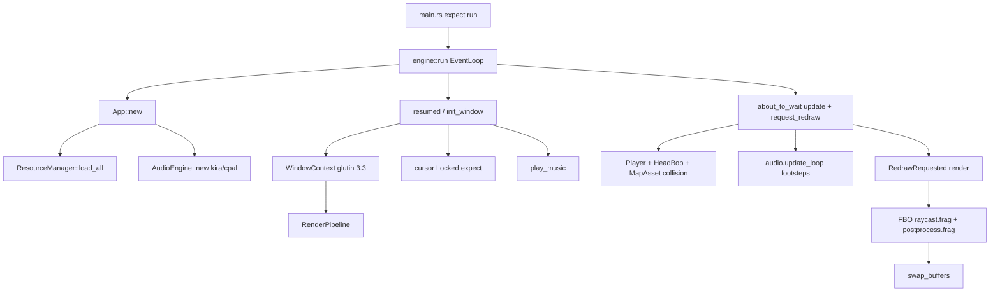

# Архітектура `pseudo3d`

Огляд коду на гілці `main`, коміт `33767305be1149970f2c64849e5d06ecbfdda770` (`feat: sounds`). Це опис того, що є в дереві, а не пропозиція перепису. Не вигадано модулів, типів і файлів: немає `src/input/`, немає ECS, немає окремого world-крейту.

Рантайм-паніки (аудіо без пристрою, `CursorGrabMode::Locked`) зафіксовані в [issue #1](https://github.com/wismh/underlife/issues/1).

У тексті твердження без позначки — факти з коду. **Гіпотеза** — висновок, не підтверджений тестом у репозиторії.

---

## 1. Що це за програма

Це **рейкастер у стилі Wolfenstein** (DDA по сітці), не CPU software-рендерер і не 3D mesh-пайплайн.

- **Вікно:** `winit` 0.30, `ApplicationHandler` (`src/engine/app.rs`).
- **GL:** `glutin` 0.32 + `glutin-winit` 0.5, **OpenGL 3.3 core** (`ContextApi::OpenGl(Some(Version::new(3, 3)))` у `src/engine/window.rs`).
- **Лоадер:** `glow` 0.16.
- **Малювання:** **retained** GPU-об’єкти (програми, порожній VAO, текстури, FBO) + **один fullscreen-трикутник на пас** через `gl_VertexID` (`draw_arrays(TRIANGLES, 0, 3)`). Немає VBO, мешів, CPU-циклу по колонках.
- **Проекція:** 2.5D. Камера — `pos` + `dir` у площині XY. FOV задається вектором **plane**. Фрагментний шейдер збирає його як `vec2(-dir.y, dir.x) * 0.66` (`assets/shaders/raycast.frag`). `Player.plane` / `plane_scale` з `player.toml` **не** завантажуються в GPU.
- **Постпроцес:** color FBO → vignette fullscreen-пас (`OpenGlPostFx`).
- **Аудіо:** `kira` 0.12 / `cpal`.

Жанр: прогулянка лабіринтом від першої особи (одна захардкоджена demo-мапа), WASD + mouse look, зациклені кроки, один музичний трек.

---

## 2. Карта крейту / модулів

Бінарник — один рядок:

```rust
// src/main.rs
fn main() {
    pseudo3d::run().expect("engine run failed");
}
```

`src/lib.rs` експортує п’ять модулів і `engine::run`.

```
pseudo3d
├── engine     вікно + App (корінь композиції, цикл, інпут, wiring демо)
├── game       Player, HeadBob, PlayerConfig  (немає світу, немає сутностей)
├── render     пайплайн, GPU-рейкаст, пост-FX
├── audio      kira AudioEngine + заглушки міксера
└── resources  ID з маніфесту, лоадери, TypedStore
```

| Модуль | Роль | Залежить від |
| --- | --- | --- |
| `engine::app` | Event loop, god-object `App`, захардкоджені UID демо (`texture::BRICK`, `map::DEMO`, …) | audio, game, render, resources, winit |
| `engine::window` | Вікно, контекст GL 3.3, surface, vsync, володіє `RenderPipeline` | render, glutin, winit |
| `game::player` | Поза + колізія проти `MapAsset` | resources (map) |
| `game::head_bob` | Зміщення walk/idle | числа з `PlayerConfig` |
| `game::config` | Парсинг `player.toml` через `ConfigAsset` | resources |
| `render::pipeline` | Scene FBO + raycast + post | opengl backend, `MapAsset` / `TextureAsset` / `ShaderAsset` |
| `render::raycast` | `RaycastRenderer<B: RenderBackend>` з завантаженими текстурами | типи resources, `RenderBackend` |
| `render::backend::opengl` | Реальний GL: compile, uniforms, upload, draw | glow, glutin config pick |
| `render::postprocess` | `PostFxSettings` + трейт `PostProcessBackend`, **параметризований на `glow::Context`** | glow |
| `audio::engine` | kira manager, кеш кліпів, лупи, музика A/B, пул one-shot | resources, kira |
| `audio::{api,presets,spatial,volume,mixer}` | типи, resolve пресетів, 2D pan, dB, **stub mixer** | UID resources |
| `resources::*` | згенеровані `build.rs` ID, `ResourceManager::load_all`, TypedStore | FS, toml, image |

**Циклу `mod` немає** (крейт збирається). Є **перевернутий шар**:

- `ConfigAsset::post_fx` повертає `crate::render::{PostFxSettings, VignetteSettings}` (`src/resources/types/config.rs`). Шар ассетів знає типи рендера.
- `engine` знає всі згенеровані UID і всі геймплей-системи.

**God-object:** `App` володіє вікном, resources, audio, player, head-bob, набором клавіш, post-FX, handle лупу кроків і `PlayerConfig`.

**Двигун vs гра:** `engine` не є перевикористовуваним хостом. Правила демо живуть там: яка мапа, які текстури, WASD, Escape → вихід, старт музики, луп кроків. `game` — лише поза + bob + TOML-структури.

**Фейкова vs реальна абстракція:**

- `RenderBackend` виглядає як multi-backend. `RenderPipeline` — це `RaycastRenderer<OpenGlBackend>` плюс `OpenGlPostFx`. Пост **не** за `RenderBackend`; він бере `&glow::Context`.
- `MixerState` — «placeholder hooks» з порожніми `set_ducking` / `set_reverb_send` / `set_eq_low` (`src/audio/mixer.rs`). `AudioEngine` все одно його зберігає.

**ECS немає.** Стан — кілька структур на `App`.

---

## 3. Кадровий цикл (вікно, події, таймінг)

### Старт (до будь-якого кадру)

```
main
  → pseudo3d::run()                          // engine/app.rs:17
      EventLoop::new()?                      // потрібен DISPLAY / Wayland
      listen_device_events(WhenFocused)
      App::new()                             // ассети + аудіо, вікна ще немає
      event_loop.run_app(&mut app)
```

`App::new` (`src/engine/app.rs`, ~рядки 39–62):

1. `ResourceManager::load_all()` — panic, якщо немає каталогу ассетів / decode.
2. Парсинг postprocess + player configs (`.expect`).
3. `AudioEngine::new(&resources).expect("init audio engine")` — **відкриває cpal/ALSA тут**, до `resumed`.
4. `create_loop_handle()` для кроків.
5. Спавн `Player` з TOML; `window: None`.

**Факт (прогін цього дерева):** немає звукового пристрою → panic на `app.rs:47` до появи вікна. Див. [issue #1](https://github.com/wismh/underlife/issues/1).

### Хто володіє вікном / GL

`WindowContext` (`src/engine/window.rs`) володіє:

- `Arc<winit::window::Window>`
- `glutin` `Surface<WindowSurface>` + `PossiblyCurrentContext`
- `RenderPipeline` (GL-об’єкти)

Створюється лише в `ApplicationHandler::resumed` → `init_window`.

`init_window` (`app.rs`, ~65–87):

1. `WindowContext::create(..., raycast_shader, post_shader)` — вікно, GL 3.3, swap interval **Wait(1)** (vsync), лоадер `glow`, `RenderPipeline::new`.
2. `upload_gpu_resources` — brick/floor/sky + `map::DEMO` у рендерер.
3. `capture_mouse` — `CursorGrabMode::Locked.expect("capture mouse")`.
4. `audio.play_music(Preset(MUSIC), loop, fade 2s)`.
5. Зберегти вікно.

**Факт:** на TigerVNC і Xvfb panic на `app.rs:93` після створення GL і upload, тож **кадр `RedrawRequested` не виконується**. Див. [issue #1](https://github.com/wismh/underlife/issues/1).

### Розклад колбеків

| Колбек | Що робить |
| --- | --- |
| `resumed` | `init_window` один раз |
| `window_event` | close/Escape → `event_loop.exit()`; фокус → grab/ungrab + `mouse_look`; resize → `window.resize`; клавіші в `HashSet<KeyCode>`; `RedrawRequested` → `render()` |
| `device_event` | якщо `mouse_look`, `MouseMotion.delta.0` → `player.rotate(delta * mouse_sensitivity)` (лише yaw) |
| `about_to_wait` | якщо вікно є: `dt = min(elapsed, 0.05)`, `update(dt)`, `request_redraw()` |

**Таймінг:** `Instant`, **стеля 50 мс**. Не fixed-step, немає акумулятора. `about_to_wait` + `request_redraw` — poll-цикл; vsync — очікування swap-interval у `present()`.

**Гіпотеза:** якщо композитор ніколи не блокує vsync, `about_to_wait` може крутитися так швидко, як дозволяє event loop. У цьому репо це не вимірювалось.

`render()` збирає `RaycastScene` з player + head-bob, `renderer.draw`, `swap_buffers`.

Окремого модуля інпуту **немає**. Стан клавіш — `App.keys`. Mouse grab — методи `App`.

---

## 4. Пайплайн рендеру

```
RaycastScene (CPU uniforms)
        │
        ▼
RenderPipeline::draw
  OpenGlPostFx::begin_scene_pass   bind scene FBO, viewport, clear
  RaycastRenderer::draw
    OpenGlBackend::begin_frame     clear, bind raycast program + порожній VAO
    OpenGlBackend::draw_raycast    uniforms + 4 текстури + draw 3 verts
    end_frame                      no-op
  OpenGlPostFx::apply_postprocess  default FB, vignette program, draw 3 verts
WindowContext::present             swap_buffers
```

### CPU vs GPU

**CPU:** decode PNG → RGBA (`TextureAsset`), парсинг мапи в `cells` + `collision` R8, компіляція **рядків** шейдерів, upload один раз. Кожен кадр: зібрати `RaycastScene` (розмір, pos, dir, bob). Колізія `Player::move_relative` читає `MapAsset` на CPU.

**GPU:** DDA в `raycast.frag` (макс. 64 кроки). Мапа — `sampler2D` R8; стіна якщо `texture(u_map).r > 0.5`. Підлога/стеля — affine «row distance», не другий рейкаст по висоті.

Fullscreen-трикутник генерується в **обох** vert-шейдерах (`raycast.vert`, `postprocess.vert`) з `gl_VertexID`. CPU vertex data немає.

### Камера / проекція

Класичний рейкастер:

```
camera_x = 2 * frag.x / width - 1
plane = perpendicular(dir) * 0.66     // ЗАХАРДКОДЖЕНО в шейдері
ray_dir = dir + plane * camera_x
```

`Player` тримає `plane` з `plane_scale` (`player.toml` = `0.66`), але `RaycastScene` має лише `player_pos` / `player_dir` / `view_bob`. Зміна `plane_scale` **не змінює FOV на екрані**. Це підтверджений розрив data-path, не гіпотеза.

Head-bob: `u_view_bob.x` зсуває world pos уздовж camera right; `u_view_bob.y` зсуває горизонт у **пікселях** (коментар на `RaycastScene`).

Fog, max steps, затінення сторони стіни (`0.75` на Y-хітах), стеля `* 0.85` — **константи шейдера**.

### Data-driven vs hardcoded

| З даних | Захардкоджено в engine/shader |
| --- | --- |
| Вихідники шейдерів через маніфест | GL 3.3, NEAREST wall/floor, REPEAT wrap |
| PNG (який файл) | Який UID є wall/floor/ceiling (`BRICK`/`FLOOR`/`SKY`) |
| Розкладка `demo.map` | Одна мапа `map::DEMO`; клітинки зведені до 0/1 стіна |
| Vignette з `postprocess.toml` | Unity-style remap у `VignetteSettings::unity_shader_settings` |
| Швидкості, bob, spawn з `player.toml` | FOV `0.66` у frag; вікно 1280×720 / title `"pseudo3d"` |
| | `MAX_STEPS = 64`, `FOG_DISTANCE = 8.0` |

`pick_gl_config` віддає перевагу конфігам з transparency, потім **меншій** кількості семплів (`src/render/backend/opengl/mod.rs`). Для гри нетипово (MSAA рейкаст усе одно не використовує).

`GlTexture` **немає `Drop`**. `OpenGlBackend::drop` видаляє лише program + VAO. Повторний `set_*_texture` витікає попередню GL-текстуру. **Факт** з impl Drop, не з leak-профілювальника.

---

## 5. Світ / мапа / стан гри

Це **не** симуляція світу. Одна статична `MapAsset` і один `Player`.

`demo.map` — ASCII: `#`/`1` стіна, `.`/`0`/` ` порожньо, будь-який інший символ — стіна (`parse_row`). Коментарі `;`, порожні рядки пропускаються. Дубль: `cells` (0/1) і `collision` (0/255) для GPU.

**Завантаження:**

1. **Build:** `build.rs` парсить `assets/manifest.toml`, пише `OUT_DIR/asset_ids.rs` (константи UID + слайси `TEXTURES`/`MAPS`/…), копіює `assets/` → `target/{debug,release}/assets`.
2. **Runtime:** `ResourceManager::load_all` шукає корінь (`PSEUDO3D_ASSETS`, інакше `assets/` поруч з exe, інакше лише в debug `CARGO_MANIFEST_DIR/assets`), потім вантажить **кожний** запис маніфесту в `TypedStore` (vec за індексом UID).

Володіння: `App.resources` після лоаду незмінний (`&self` getters). GPU-копії живуть на `RaycastRenderer`. Зміна мапи в рантаймі не оновить R8-текстуру, поки знову не викличуть `set_map` (ніхто не викликає).

`Player` мутує `pos`/`dir`/`plane`. Колізія: по осях, `is_wall` через `floor` клітинки, потім clamp до `[0.25, dim-1.25]`. Немає сутностей, дверей, спрайтів, висоти.

---

## 6. Аудіо

`AudioEngine::new`:

- `AudioManager::<DefaultBackend>::new` (cpal).
- Сабтреки SFX + music; kira `add_listener` (3D listener; поле з `#[allow(dead_code)]`, але `set_listener` його використовує).
- `StaticSoundData::from_file` для кожного запису `SOUNDS` (decode на старті, не стрім).
- `SoundPresetRegistry` мапить TOML `clip = "footsteps"` → UID через **рядкове ім’я** (`sound_by_name`), не через UID у пресеті.

**Що реально викликає `App`:** `create_loop_handle`, `update_loop` (кроки під час WASD), `set_listener(pos/dir гравця)`, `update`, `play_music` один раз. `PlayParams::default()` — **без `spatial`**. Кроки не паннуються за відстанню.

**`spatial`:** CPU linear falloff + pan від правого вектора слухача. `let _ = linear_to_decibels(volume_linear)` — no-op. `App` ніколи не передає `SpatialParams`. Орієнтація kira listener все одно оновлюється.

**Mixer:** заглушка. API гучності (`set_master_volume`, …) `App` не викликає.

**Політика помилок:**

- Ініт: `Result`, потім **`expect` в `App`** → смерть процесу ([issue #1](https://github.com/wismh/underlife/issues/1)).
- Playback: `eprintln` і skip (пул one-shot повний, невідомий кліп).

`SoundAsset::load` лише перевіряє `path.is_file()`; помилки decode — у kira всередині `AudioEngine::new`.

---

## 7. Інпут

Усе в `App`:

- **Клавіші:** фізичні `KeyCode` у `HashSet`. W/S вперед, A/D strafe, стрілки крутять **лише якщо `!mouse_look`**, Escape виходить.
- **Mouse look:** `DeviceEvents::WhenFocused` + `DeviceEvent::MouseMotion`. Sensitivity з TOML. **Немає pitch** (для цього рендерера коректно).
- **Grab:** `Locked` на init і на фокус; `None` при втраті фокусу. При unfocus помилка grab ігнорується (`let _ =`); **init / focus-gained — `expect`**. Асиметрично і фатально на VNC/Xvfb ([issue #1](https://github.com/wismh/underlife/issues/1)).

Немає action map, ребайнду, шару розкладки (лише physical codes).

---

## 8. Build / ассети

`Cargo.toml`: немає `[features]`, немає `rust-version`, `build = "build.rs"`. Lockfile тягне `wayland-protocols` з **edition 2024** → **Rust ≥ 1.85**, хоча крейт — edition 2021.

`build.rs`:

- `cargo:rerun-if-changed` на `assets/` і `manifest.toml` (і на кожен шлях sound/preset/config у відповідних секціях).
- Генерує типізовані UID-модулі (`texture::BRICK`, …).
- Копіює все дерево `assets` поруч з бінарником (`CARGO_TARGET_DIR` або `./target` + `PROFILE`).

`.gitattributes`: `*.png` `*.ogg` `*.mp3` → Git LFS. Клон з `GIT_LFS_SKIP_SMUDGE` лишає pointer-файли; тоді `image::open` / kira падають на лоаді.

Маніфест — **єдиний** реєстр ассетів. Текстура без `[[texture]]` копіюється на диск, але UID не отримує.

---

## 9. Помилки й тестованість

**`Result` є, потім `expect` на швах, які важливі:**

- `run()` → лише `EventLoopError`; `main` робить expect.
- Вікно/GL: усі `.expect` / `.unwrap` (`window.rs`, компіляція шейдерів — `panic!`).
- `ResourceManager::load_all`: expect на кожен файл.
- `TypedStore::get`: panic, якщо UID немає.
- Парсинг конфігів: `Result` всередині, `expect` у `App::new`.

`ShaderAsset` імплементує `Asset::load` як **завжди `UnsupportedLoader`**; реальний шлях — `load_pair`. Мертва impl трейту.

**Тестів немає** (`#[test]` / `mod tests` відсутні). Парсер мапи, колізія, blend bob, spatial pan, TOML-лоадери і розрив plane vs шейдер — не покриті. `cargo test` — порожній pass.

**Що блокує тести:** `App` не generic над audio/window; `AudioEngine::new` хоче реальний backend; `WindowContext::create` хоче дисплей; `ResourceManager::load_all` — all-or-nothing і panic.

---

## 10. Рантайм (діаграма)



---

## Вердикт

**Нормально для малого прототипу**

- Чіткий поділ **ID ассетів** (`build.rs`) і **байтів** (runtime).
- GPU-рейкаст — слушна вартість для fullscreen Wolfenstein-вигляду; шов `RenderBackend` + `RaycastRenderer<B>` має сенс, **якщо** другий backend буде реальним.
- Колізія гравця і occupancy, яку семплить шейдер (R8 > 0.5 vs `cell != 0`), узгоджені.
- Поверхня аудіо API (пресети, лупи, crossfade музики, пул one-shot) ширша за демо — ця частина структурована.
- Post FX у TOML з іменованим Unity vignette remap.

**Що заважатиме рости**

1. **`App` і є гра.** Наступний ворог, зброя чи друга мапа нарощуватимуть поля і `resources.foo(uid::BAR)` в `update`/`render`.
2. **Фатальний `expect` на опційних платформених штуках** (звуковий пристрій, cursor lock, swap interval) — бінарник не живе саме там, де розробка/CI. Див. [issue #1](https://github.com/wismh/underlife/issues/1).
3. **Стан камери дубльований і розсинхронізований** (`Player.plane` vs `0.66` у шейдері).
4. **`RenderBackend` застосований наполовину** (post і pipeline все ще glow-specific). Або один GL-шлях, або довести трейт.
5. **`resources` залежить від типів `render`**, пресети звуків — рядкові імена кліпів.
6. **Немає тестів** на чистому коді (парсер мапи, рух, bob, таблиці UID).
7. **Зв’язка AudioEngine ↔ App:** ~700-рядкова обгортка kira конструюється через `expect` ради двох звуків. Stub міксера обіцяє майбутнє, яке не підключене.
8. **Час життя GL-ресурсів** (витік `GlTexture` при replace/drop) стане важливим при hot-reload мап/текстур.

План робіт з пріоритетами: [PLAN.md](PLAN.md).
